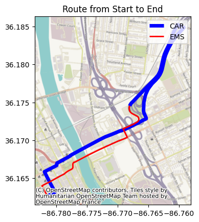

# EMS_OSRM
This docker is trying to recreate an EMS oriented routing service.
This will allow EMS to drive on the opposite road and would not be blocked by bollards etc..

This is a work in progress. I'm not entirely sure this is effective.

## Output Example

Here the red route is the EMS vehicle while the blue one is the normal vehicle. The EMS vehicle is passing through some one way street.


## Setup
```bash
cd docker

curl -L "https://download.geofabrik.de/north-america/us/tennessee-latest.osm.pbf" -o ./data/osm.pbf
touch ./data/speeds.csv
docker build --platform=linux/amd64 --no-cache --tag tn_osrm:ems -f Dockerfile .
docker run -d --name ems_osrm -m=4g -p 8085:8085 tn_osrm:ems
```

## Notes
* Note car.lua seems out of date from latest OSRM (same as the base image of this)